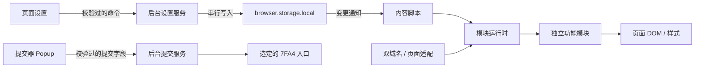

# 架构决策

## 当前边界

### 真实姓名（2026-10-01）

- 新增 `real-names` 模块，默认开启且全站匹配。站点适配器只处理 `a[href^="/user/<id>"]` 形式的纯文本链接，按用户 ID 查表把昵称替换为真名，并在其后追加毕业信息后缀；含元素子节点（头像、图标）的链接跳过，避免破坏原节点。
- 数据来自 Better-Names-for-7FA4 的用户表，转换为 `src/features/real-names/users.ts` 后随包发布，键为用户 ID，`title` 保留原始届别标记。展示文案集中在 `labels.ts`：四位年份显示“高中毕业：%d”，`by` 显示“毕业”，`uk` 显示“年份未知”，`jl` 显示“教练”。不联网查询，未收录的 ID、空名字或已是真名的链接不改动。
- 毕业信息写入链接的 `title`，由浏览器在悬停时显示，不插入可见节点，表格宽度不受影响；清理时仅当 `title` 仍等于写入值时恢复原属性。
- 类型检查、lint、light 构建与现有 26 项测试通过。页面链接结构与实际替换效果尚未在真实站点验证。

### 首页布局与配色（2026-09-29）

- 首页布局统一在设置面板编辑，支持显示开关、拖动或箭头排序、跨栏移动及恢复默认。沿用设置存储和后台串行命令，旧设置缺少布局字段时补齐默认值；关闭模块或总开关保留偏好并恢复原站布局。
- 适配器只处理首页已识别的标题与内容节点对，移动原节点并用注释锚点记录原位，保留事件和动态内容；未知板块保留，账号没有的板块不创建。默认配置不改动结构，停用、离开首页或 Scope 释放时还原；兼容板块内容及整组网格替换。
- 六组预设提高亮度，旧预设颜色迁移到对应新值；其他自定义色保留。填充按钮使用独立的 `--av-solid`，与文字强调色分别校正对比度，避免导航文字约束让按钮过暗。“关于”产品标识居中，版权使用普通 © 字符并修正英文拼写。
- 新增 8 项首页布局测试，覆盖设置迁移、命令校验、串行更新、节点与事件保留、隐藏和跨栏移动、恢复及动态节点替换；与已有测试合计 21 项通过。Biome、TypeScript 和两版构建通过；本地浏览器预览验证设置拖动、保存、重置、深色与窄屏布局，预览使用模拟设置后台，不代表已重新加载用户安装的扩展。

### Pro 优先运行（2026-09-29）

- 普通版独占 `management` 权限，后台同步注册扩展安装/启用监听，启动及页面注入前查询已启用的 Asterveil Pro。未打包安装的 ID 随路径变化，因此按扩展类型、准确名称及 enabled 状态识别，并排除自身 ID。
- 普通版内容脚本等待后台检测通过后才修改 DOM。检测冲突后先通知目标标签页释放模块、主题、设置入口和订阅，再用自身 runtime ID 停用普通版；消息只接受自身后台发送，后台查询只接受已有站点校验通过的顶层内容脚本。冻结或无接收器的页面不阻塞停用，清理最多等待一秒。
- 停用作用于整个普通版扩展，包括后台、工具栏和网络规则；不写入用户总开关、不删除设置或已保存草稿。重新启用需用户先停用 Pro；切换后刷新页面。Pro 不包含检测服务的运行入口，也不申请管理权限。
- 使用 [Chrome management API](https://developer.chrome.com/docs/extensions/reference/api/management)；其 [Chromium 实现](https://raw.githubusercontent.com/chromium/chromium/main/extensions/browser/api/management/management_api.cc) 的禁用分支不依赖用户手势，仍遵循浏览器管理策略。
- 13 项自动化测试覆盖 Pro 已启用、后续安装/启用、重复与过期事件、未启用及同名非扩展排除、查询失败恢复、页面清理超时和管理策略拒绝。Biome、TypeScript、两版构建与 ZIP 打包通过，产物确认只有普通版包含管理权限及检测服务。测试使用模拟浏览器 API，尚未在真实浏览器中验证自动停用流程。

### light / full 构建（2026-09-29）

- WXT 的 `light` / `full` 模式生成独立目录和 ZIP，扩展名称分别为 Asterveil / Asterveil Pro，工具栏提示、设置标题、关于页与弹窗标题同步使用对应名称。构建常量控制编辑器名称与 PDF 入口，模块 ID 继续使用 `homework`，保留原有设置和草稿键。
- 构建目录为 `.output/Asterveil` 与 `.output/Asterveil Pro`，ZIP 使用对应产品名、版本与浏览器名称，不再把 light/full 作为显示名称。`config:resolved` 统一设置输出路径和 ZIP 名称，开发构建额外加 `-dev` 后缀，避免覆盖发布产物。
- light 使用 Markdown Editor，full 使用 Markdown Editor Pro。两版共享全部 Markdown、图片导出和提交逻辑；PDF 导出独立为 `pdf-export.ts`。light 构建插件在解析阶段排除两项 PDF 模块，并检查最终 chunk 的模块列表，任何 PDF 依赖混入都会使构建失败；不复制 PDF 资源或声明对应 web-accessible resources。
- 保留 Marked、DOMPurify 和 KaTeX 的完整功能与安全边界，共用官方压缩版 KaTeX CSS 和 WOFF2 字体，避免维护两套渲染器。精简重点是实际排除 PDF 依赖，未通过裁剪数学字体或切换原生 MathML 牺牲已有公式排版。
- 浏览器夹具验证两版命名、PDF 入口差异、HTML 清理、数学字体、PNG 与提交预览；Pro 额外验证多页 PDF 往返及无效文件拒绝。包含中文、求和、积分、分式、根号、表格和任务列表的样例，两版与精简前样式的 PNG 像素哈希一致。生产 light 包中无 PDF 库、资源或资源访问声明，ZIP 约 427 KB；full 约 3.26 MB。

### Markdown Editor 作答（2026-09-28）

- 独立 `homework` 模块默认开启，匹配普通题目及模测内题目详情。站点适配器要求 H 开头的标题、原答案图片上传表单与同源提交地址；编辑器插在已提交作业之后、原上传入口之前。
- 编辑器使用 Shadow DOM，提供图标工具栏、左右编辑/预览与底部操作栏。导出菜单包含 PNG、PDF 和 Markdown；窄屏上下排列。草稿及作业折叠偏好按账号与题目路径保存在扩展本地存储，两个入口共用，不触发远程同步。保存失败有反馈，未编辑时不会覆盖读取失败的已有草稿。
- Marked 解析 Markdown，DOMPurify 先清理用户 HTML，再由关闭 `trust` 的 KaTeX 填充随机标记的公式占位符。KaTeX 使用 HTML + MathML，保留官方排版度量、根号 SVG 与居中块级公式。构建插件内嵌 WOFF2 字体，文档级字体与 Shadow DOM 排版样式分开挂载；导出使用同一组字体。
- html-to-image 生成固定宽度白底 PNG，限制画布尺寸；图片读取有超时，跨域或加载失败会报错，避免静默漏图。Pro 使用 pdf-lib 按 A4 分页并优先选附近空白行，PDF.js 在本地将上传的 PDF 逐页渲染并合并为 PNG，限制 20 MB、20 页和 3200 万像素。
- 原站只接受答案图片，因此 Markdown 和 PDF 均先生成图片预览，用户确认后通过独立 multipart 表单提交，保留原 action、query 与隐藏字段，避开纸面题原脚本对代码编辑器的引用。PDF.js 使用本进程 worker、关闭 WASM，所需字体、CMap、解码回退及许可证随包发布；不增加权限或第三方转换服务。
- “已提交作业”标题栏保留展开/收起入口，整体折叠图片、批改与评价并记住选择。标题与内容共用连续边框和外侧圆角。关闭模块中止任务，清理 DOM、事件、字体与预览 URL，并恢复原作业样式。
- 构建设置 `output.minify.codegen.asciiOnly`，避免压缩器将 KaTeX 的转义字符输出成 Chrome 拒绝加载的字面 Unicode 非字符。`build:done` 对清单中的 JS/CSS 严格检查 UTF-8 和 Unicode 非字符；相关依赖许可证复制到发布包。
- 验证覆盖公式、中文、安全清理、长图、多页 PDF、错误与取消、草稿和折叠记忆、停用恢复及窄屏布局。本地 multipart 服务核对图片签名、隐藏字段和 query；构建通过编码检查。实际站点未发送测试答案，服务端接收与内网环境不在这些检查的覆盖范围内。

### 题目页复制与代码编辑区（2026-09-28）

- `ui-polish` 在普通题目和模测内题目挂载复制工具。源码按钮使用页面已有的同源 Markdown 链接，点击时读取独立源码页面的 `pre` 文本，保留原始空白，拒绝重定向和失败响应；有超时与取消处理。标题双击复制完整可见文本，反馈通过伪元素显示，不写入标题内容。
- 两项工具共用 `platform/clipboard.ts`：优先使用 Clipboard API，失败时通过临时只读文本框复制，完成后恢复焦点与选区。Scope 负责清理事件、按钮、提示属性和定时器，不增加剪贴板权限。
- `site/code-editor.css` 根据原站 `#testcase-menu` 和 Monaco DOM 调整答案提交题的文件栏、边框、上传区及主题色，保留 Monaco 内部尺寸、字体和事件管理。传统代码题语言列表与答案提交题编辑列的高度统一为 480px。
- 实页预览核对文件栏与编辑器尺寸、输入及清理、390px 下无新增横向溢出。格式、类型、生产构建与 ZIP 检查通过；高度调整在后续构建中生效。

### 深浅色模式（2026-09-28）

- 设置面板后续精简：弹窗 backdrop 改为透明，保留模态焦点与点击外部关闭；删除界面预览及其样式、系统模式监听。保存期间不显示进度提示、不禁用整组控件，连续修改继续交由后台串行写入，待本面板请求完成后再同步控件；失败仍显示错误与重试。延迟写入夹具 13 项检查通过，覆盖透明遮罩、预览移除、连续换色、保存前后高度不变、失败恢复和重试。

- 后续修正：进度侧栏内部 `.accordion` 没有 `ui styled` 类，且展开标题与导航下拉菜单的原站规则优先级更高；增加限定于深色模式的嵌套选择器。实页验证分类展开/收起、用户名悬浮菜单及登录凭证二级菜单的背景、文字和悬停色，不修改菜单行为。

- `Settings.colorMode` 支持 light / dark / system，保持 schemaVersion 1；缺失字段按 light 补齐，未知值拒绝。设置命令沿用现有串行写入与变更订阅，不增加权限、网络请求或持久键。
- `shared/color-mode.ts` 管理系统偏好监听及 Scope 清理；网页主题、Shadow DOM 设置和提交器弹窗共用调色逻辑。切换模式只更新属性与颜色变量，不重建计划目录或模块。
- 深色背景、表格、表单、菜单、代码区采用局部样式；图片、图表与编辑器保留自身显示。Accepted/满分保持蓝色语义并提高亮度，题目及模测操作按钮保留站点配色。打印使用浅色变量，深色规则只在屏幕生效。
- 73 项临时断言验证旧设置迁移、非法输入、串行更新、系统模式解析/监听释放，以及六套预设和极端自定义颜色在深浅模式下的强调色对比度。首页、题面、评测、计划、设置与弹窗使用实际代码预览，检查实时切换、系统偏好模拟、打印、390px 设置布局及美化启停。预览使用模拟设置后台，不代表已重新加载用户安装的扩展；内网仍未联网验收。

### 头像替换（2026-09-28，2026-09-29 扩充样式）

- 首页实测使用 `gravatar.loli.net` 镜像。`public/gravatar-rules.json` 使用静态 MV3 请求规则，在请求发出前拦截来自两个目标站点的 Gravatar 官方及镜像图片请求；包含子域名，不扩大到其他网站。新增 `declarativeNetRequest` 权限，不读取响应、Cookie 或浏览器历史。规则配置参考 [Chrome declarativeNetRequest 文档](https://developer.chrome.com/docs/extensions/reference/api/declarativeNetRequest)。
- `local-avatars` 默认开启，独立于界面微调。后台在广播设置变更前更新规则状态，启动时与持久化设置同步；规则更新串行执行，存储写入失败则恢复已保存设置对应的规则。总开关和模块开关均控制拦截与替换。
- `shared/avatar.ts` 与 `shared/avatar-characters.ts` 生成无外部资源的 SVG data URL。设置中的 `avatarStyle` 在几何方块、花瓣、小怪物、小团雀、猫咪、方脑袋、小芽灵七种样式之间切换，统一应用到全部头像；每个头像标识固定生成配色和图案细节，旧设置默认补齐几何方块。界面名称为“头像替换”，内部继续使用 `local-avatars` ID，保留已有开关选择。`site/avatars.ts` 保留图片尺寸、链接及其他属性，处理 img、picture source、srcset 和常用延迟加载属性；停用时仅恢复仍由模块持有的属性，保留站点后续改动。
- 角色的配色、轮廓、表情分别由头像标识确定，同色也有不同细节。设置卡片使用自适应网格排列七种带预览的原生单选框，选择通过后台串行命令保存。`ModuleDefinition.configurationKey` 只为头像模块声明样式依赖；样式改变时清理并重新挂载头像模块，其他模块不重建，过期的异步加载不挂载旧样式。新增 5 项测试覆盖设置迁移和校验、并发写入、样式一致性、动态头像及还原、过期加载，总计 26 项测试通过。
- 七样式本地预览夹具使用正式生成器、设置控件和头像适配器，逐一验证 8 张头像同步切换、停用后选项禁用以及刷新后恢复选择；另检查桌面单行排列、390 × 844 窄屏换行及深色显示。后台存储为模拟实现，未重新加载用户已安装扩展。两版 ZIP 构建及包内容校验通过。
- 实页预览：248 张图片全部换为可加载的本地头像，共 117 种样式，尺寸不变。临时本地夹具验证动态添加、头像标识更新、响应式图片、不同域名/尺寸的一致性、非 Gravatar 图片不变及停用恢复；夹具用 CSP 禁止远端图片，不代表实际扩展网络规则的端到端验证。正式拦截需重新加载扩展后生效。
- 临时检查覆盖域名边界、SVG 内容安全、稳定生成、打包规则范围与 manifest、串行启停及规则失败后的重试恢复；未增加测试依赖。

项目采用可演进的浏览器扩展基础，当前包含主入口美化和页面内设置。已通过浏览器检查外网入口各主入口与个人主页；内网入口当前返回 `ERR_CONNECTION_CLOSED`。双域名配置完成不代表内网验收完成。

### 实际站点观察（2026-09-27）

- 首页提供学习、模测、评测、进度等普通链接入口；学习链接 `/problems/exercises` 本次导航落在 `/problems/tag/...`，模块应匹配实际路径族，而非写死某个标签或账号 ID。
- 习题页 DOM 包含 `.ui.fixed.borderless.menu`、`.pusher`、侧边菜单及 `.ui.table`。页面声明加载 Semantic UI 2.4.1、jQuery 3.3.1 与站点自身样式和脚本。以上是 DOM 和资源标签观察，不推断服务器技术栈。
- 继续使用隔离内容脚本和局部 CSS；不替换站点全局库，不依赖其内部 JavaScript 对象。具体业务模块引入时，再在站点适配层确认对应容器和动态更新行为。
- 本次未操作提交题目、账户设置、聊天或登录凭证功能；仓库仅记录页面结构，不保存账号数据或页面快照。

## 工具链比较

| 方案 | 收益 | 本项目的代价 |
| --- | --- | --- |
| 原生 Manifest + 手写 Vite 构建 | 完全控制输出和目录 | 多入口、热更新、打包以及上下文清理约定需自己维护 |
| CRXJS | 沿用 Vite 和 manifest 驱动的工作流，支持内容脚本热更新 | 仍需独立组织扩展生命周期、设置与模块边界 |
| Plasmo | 入口约定及存储、消息工具完整，支持多种 UI 框架 | 可以满足需求，但本阶段主要工作是 DOM 增强，其组件集成优势暂不突出 |
| **WXT** | 多入口、MV3 构建、上下文失效通知、后续跨浏览器路径 | 需要遵循入口约定，并将业务契约保持在框架之外 |

选择 **WXT + 严格 TypeScript + 原生 DOM/CSS**。不宣称它在所有项目中最快；这是一项围绕当前需求、依赖范围及维护成本的工程选择。包版本与 lockfile 固定，实际输出体积通过构建检查。暂不引入 React/Vue、全局状态库、通用事件总线或依赖注入容器。以后复杂面板可以独立选用组件库，不改变模块运行时。

参考官方资料：[WXT](https://wxt.dev/guide/introduction)、[内容脚本生命周期](https://wxt.dev/guide/essentials/content-scripts)、[CRXJS](https://crxjs.dev/guide/introduction/)、[Plasmo](https://docs.plasmo.com/)。

## 执行与数据边界

- **站点配置**是唯一域名来源，两个入口对应同一产品，不自动跳转、不跨入口请求，也不复制登录状态。匹配模式采用精确主机名；运行时通过 `URL.origin` 限定到 HTTPS 的 8888 端口。
- **内容脚本**运行在隔离环境，直接操作共享 DOM。当前没有主世界脚本或网页消息桥。页面本身不能通过一个公开消息入口修改设置。
- **功能目录**按能力划分，每个模块独立注册、匹配和加载。元数据与实现分离，面板不会导入 DOM 改造代码。动态 import 是按需初始化边界；构建器可能将内容脚本依赖内联，不承诺模块一定成为独立网络分包。
- **后台设置服务**是设置的唯一应用层写入点，每次从持久存储读取最新数据，再串行执行字段更新。后台可以休眠，不依赖内存缓存作为数据来源。内存队列只协调当前实例的并发；后台异常终止时客户端得到失败并可重试，操作是幂等的布尔赋值。
- **设置消息协议**校验频道、命令、布尔参数、模块 ID、颜色以及扩展 ID 和发送页面。仅接受两个精确站点来源的顶层内容脚本（要求标签页 ID、frameId 为 0）；不开放网页消息桥。提交器使用独立频道，仅接受本扩展的 Popup，拒绝来自网页内容脚本的提交消息。持久设置独立校验 `schemaVersion`，拒绝未知版本，避免旧版覆盖未来数据。

Chrome 的 [后台生命周期](https://developer.chrome.com/docs/extensions/develop/concepts/service-workers/lifecycle) 和 [消息传递](https://developer.chrome.com/docs/extensions/develop/concepts/messaging) 是上述约束的基础。

## 生命周期与性能

1. 精确检查站点后，订阅设置变更，再读取初始快照，防止读取期间发生的更新被旧快照覆盖。
2. 只有 DOM 就绪、全局开关和模块开关都开启、路径匹配成功时，才调用该模块的加载与挂载。主题样式仍在根节点可用时准备，DOM 功能统一在 DOMContentLoaded 后启动。
3. 每个实例持有独立 `Scope`。关闭、路由变化或上下文失效会先取消任务，再逆序释放资源。已经失效的异步加载结果不会挂载；失效后才注册的清理函数立即执行。
4. 模块加载、匹配或挂载失败只停止该模块；清理函数异常也不会中断其他清理。
5. 当前目标是 Chromium 120+。同文档导航使用 Navigation API 的 `currententrychange`，并监听 `popstate`、`hashchange`；完整导航由浏览器重新执行脚本。避免常驻路由轮询和修改网站的 History 方法。页面返回缓存时保留实例，恢复时重新核对 URL。
6. 初始框架没有全站 MutationObserver、定时扫描或网络任务。后续需要处理动态列表时，由具体模块观察最小容器、处理新增节点并在 Scope 中断开观察器。
7. 示范模块使用可移除的局部功能样式表。复杂新面板使用 Shadow DOM；针对网页原有样式的覆盖由各模块单独管理，不引入全局 CSS reset。

## 服务器接入

提交器已接入上游的 `/user_api/json` 与 `/foreign_oj` 接口，保持以下依赖方向：

- 界面及模块依赖功能的类型契约，不直接依赖远端 URL。
- 后续具体业务出现时，在 `shared/` 增加该业务的数据和命令模型，在 `background/` 中实现应用服务，在 `platform/` 中添加相应 HTTP 适配器。
- 服务器请求从后台发送，凭据不进入网页 DOM；只申请实际服务域名权限，校验发送者与响应数据，支持取消和有界超时。
- 本地视觉功能继续离线工作。远程同步与本地设置存储是两种职责，不将同步简单替换为远端读写。
- 服务只能提供经校验的数据；模块始终随扩展打包，不执行远程 JavaScript。

不添加空接口、假服务器和通用 RPC 框架。

## 验证范围

保留严格类型检查、格式检查、生产构建；仅执行少量临时断言，覆盖域名/端口边界、设置校验、并发字段更新、模块停用期间的异步加载及清理。临时测试文件验证完删除。

外网主入口与个人主页已完成查看，GitHub 公开仓库已通过浏览器创建并克隆接入本地源码。自动化浏览器无法操作扩展管理页；功能代码通过临时浏览器预览验证，消息与存储接口使用模拟适配。真实扩展安装后的跨标签同步及导航生命周期仍待验收。内网入口需在可连通的网络环境验证。

2026-09-27 初始框架验证结果（后续功能见下文）：

- Biome 检查与 TypeScript 严格类型检查通过。
- WXT 0.21.4 / Vite 8.3.1 的 Chrome MV3 生产构建通过，总计 18,933 字节（约 18.9 KB）。
- 四组临时断言通过：域名/端口与协议/设置校验；并发字段写入与存储失败恢复；延迟加载取消、重复挂载、导航和资源清理；正式 Manifest 的权限及入口。
- 临时断言使用现有开发依赖与 Node 内置断言执行，没有安装测试框架；验证后删除测试源文件和生成脚本。

### 首个功能：界面微调

- `ui-polish` 默认启用，通过现有目录元数据自动生成面板开关；旧设置缺少该字段时由解码器补齐，不变更设置版本。
- 路径匹配和站点 CSS 放在 `src/site/appearance.ts`、`src/site/appearance.css` 与 `src/site/details.css`。最初覆盖首页和 `/problems` 路径族，现已扩展到下述主入口及详情页；独立编辑页面暂不应用。
- 模块挂载带根属性作用域的样式表，停用时移除并恢复属性旧值。计划页的局部增强另见下文，不替换原有表格节点或编辑逻辑。
- 在外网未登录首页及已登录习题列表预览同一份 CSS，确认面板圆角与阴影、背景、导航选中态及表格外观生效；首页 1280px 视口没有横向溢出，习题页导航高度、主容器宽度及状态图标颜色保持不变。移除预览后，习题页测量值恢复。临时预览不代表扩展面板开关和内网已完成验收。

### 主题配色

- 设置新增 `accentColor`，缺省时兼容旧版的雾蓝；消息协议仅接受六位十六进制颜色，后台仍通过串行队列更新单个字段，避免与开关写入互相覆盖。
- `ModuleContext` 携带挂载时的设置快照。页面配色由 `site/theme.ts` 独立更新 CSS 变量，切换颜色不再重新挂载 `ui-polish` 的日期目录；已移除未使用的 `configurationKey` 重启分支。
- `shared/palette.ts` 统一生成网页及面板预览的颜色变量，按需加深强调文字，保证相对于选中导航背景至少 4.5:1 的对比度。所有覆盖仍在可移除样式表内，不遗留行内样式。
- 临时断言覆盖旧设置兼容、颜色输入校验、并发写入、4096 组颜色对比度、按配置重新挂载及失效加载清理，全部通过。生产面板在本地模拟扩展消息与存储接口下验证了预设、自定义、恢复默认、重载保留和暂停后恢复；真实扩展安装后的跨标签同步及内网仍待验收。临时验证脚本和服务验证完移除。

### 页面设置与主入口扩展

- `ui/settings/` 复用面板视图和设置控制器，页面入口使用 Shadow DOM 隔离与原生 modal dialog，具备分类导航、焦点约束、Esc/遮罩关闭及窄屏布局。分类为外观配色、功能模块、关于；总开关与版本信息位于关于，自定义是配色列表第七项。设置 UI 持有独立 Scope，暂停功能不会移除重新启用所需的按钮；上下文失效时整体释放。
- 设置文案仅保留功能名称、必要说明和操作反馈，不添加口号、装饰性提示或常驻保存说明；成功保存后不显示额外状态文字，错误和加载反馈保留。
- 新增路由覆盖 `/contests`、`/submissions`、`/ranklist`、`/foreign/list/html`、`/user_plans/:id`、`/user/:id` 及 `/user/:id/squats`，账号 ID 不写死。样式使用页面属性区分表格变体，保留评测状态色和原生表单行为。
- `site/plans.ts` 依据页面日期属性识别今天，提供独立固定定位、可拖动的日期目录，点击日期定位并高亮对应行。观察计划表的子节点与日期属性变化，兼容原站异步加载，保留已有目录按钮及焦点；窗口重新获得焦点时校准日期。停用时断开观察器，移除目录和自有标记。
- 各主入口均在真实页面 DOM 上预览；学习页表头留白、计划原有展开操作及当天定位、头像区域尺寸、配色即时更新、暂停和恢复、分类切换、关闭后焦点恢复、390 × 844 窄屏面板已检查。未执行业务提交或修改账号资料。
- 新增临时断言覆盖 11 种设置发送来源、15 个路由匹配结果、旧设置兼容及多面板并发字段写入，均通过。Biome、TypeScript 与 MV3 生产构建通过，产物约 58.1 KB；未新增依赖或权限。

### 题目与评测详情（2026-09-28）

- `site/submission-code.ts` 为提交源码区添加右上角复制按钮，复用剪贴板工具并保留当前显示代码的全部空白；原生格式化按钮通过 CSS 移至左上角。观察提交详情的异步节点替换并按帧补回按钮，不对测试点输入输出添加按钮；停用清理观察器、监听和反馈计时器。
- 精确匹配 `/problem/:id` 与 `/submission/:id`，兼容查询参数和末尾斜杠，不扩展至编辑、投稿、下载或提交端点。详情样式独立置于 `site/details.css`，仍由同一个 `ui-polish` Scope 注入并清理。
- 基于实际 DOM 整理题面标题、限制标签、按钮组、章节、样例和语言菜单；评测结果表复用紧凑样式，代码区为格式化按钮保留空间，测试点折叠面板统一边框和间距。不替换原有节点、不改写公式与代码内容、不修改编辑器主题。详情 CSS 随统一页面主题提前安装与清理。
- 浏览器预览核对题面全文、公式数量、样例和原始代码均未变化；结果表状态及分数颜色保持一致。测试点展开、格式化与恢复原始代码、跳转提交区、第二题目配色及停用清理均已检查。部分未通过题目的记录会提示查看影响评级，未继续访问该确认页。
- 临时路由断言、Biome、TypeScript 和生产构建用于本次验证；预览使用实际模块代码，真实扩展安装后的跨标签同步仍沿用前述验收边界。

### 模测详情

- `site/contest-review.ts` 读取“转到习题”对应学习页的原生复盘入口，在按钮组末尾添加主题色的“写复盘表”和“看复盘表”。校验同源、题单与当前账号；每次挂载只读取一次，停用时取消请求并移除按钮，原站缺失的入口不生成。
- `/contest/:id` 的页面样式放在 `site/contest.css`，统一标题标签、时间栏、操作按钮与题目表格；进度条的成功、警告状态沿用站点颜色和宽度。`/contest/:id/problem/:id` 复用题目详情样式，不匹配比赛编辑、下载或其他操作端点。
- 在实际模测详情及模测题目页预览，核对链接目标、题目表格内容、进度条颜色和宽度均未改变；验证主题配色和清理恢复。未点击加入计划或执行业务提交。

### 聊天页面

- 精确匹配 `/chat`，`site/chat.css` 随统一页面主题安装与清理，覆盖会话列表、双方消息气泡、搜索框、输入区和操作按钮。颜色复用现有变量；窄屏改为上下布局，列表和消息区保留独立滚动。
- `site/chat-markdown.ts` 在聊天页按需加载共享 Markdown/KaTeX 渲染器和 `homework/markdown.css`。仅观察消息容器，按帧合并更新，缓存最多 100 条渲染结果；普通文本和原站图片保留，富文本放入隔离样式的 Shadow DOM。原生消息 ID 与复制事件保持不变，停用时还原原文本节点并释放观察器、字体与缓存。
- 聊天模式转义原始 HTML，Markdown 图片仅生成链接；复用 DOMPurify 与 KaTeX 的非信任模式。共享渲染器支持美元及反斜杠分隔符，代码块不解析公式。长消息保持可滚动，阅读历史时不强制滚到底部。不改变收发消息、上传图片、拍照及次数限制。
- 实页检查浅色、深色和窄屏布局；本地夹具验证公式、代码、表格、新消息、原节点更新、复制原文、移除重插、停用恢复和编辑器兼容，不发送真实消息。

### 批改、投稿与统计页面

- `site/problem-tools.css` 负责答案批改卡片、投稿表单与统计图容器；统计列表复用提交列表的紧凑样式。匹配答案页的 `best/newest/uncomment` 分类、投稿入口以及统计菜单的七种排序，不匹配编辑或操作子路径。
- 在真实页面预览中核对答案图片尺寸、评价状态、链接目标、投稿表单 action/method/类型选项、统计表文本、状态色和图表尺寸均保持不变。数据增改与提示添加的动态字段、统计排序导航、停用样式恢复通过检查。
- 验证未点击评分、发送评价、删除或添加投稿按钮；仅操作本地类型选择与只读导航。样式随现有 Scope 完整清理，无新增脚本事件或观察器。

### 整合外站提交器（2026-09-28）

- Toolbar Popup 替换为 7FA4 Submitter，设置仅保留网页右下角入口。原设置模型、颜色、Scope 与存储键保持不变；提交器使用独立的 `asterveil:submitter-origin` 键。
- 从用户提供的 submitter 0.1.13 移植外站解析，使用原生 DOM 的惰性 template 代替全站 jQuery 注入。HTML 不挂载到活动页面；昵称、服务器反馈全部作为纯文本呈现。修正原代码的未声明变量、7FA4 URL 正则分组、CSAcademy 哈希与 CF 纯文本代码回退。
- 点击发送后，通过 `activeTab` 与 `scripting` 读取当前标签顶层页面。未请求常驻外站权限或 `<all_urls>`。后台验证 Popup 来源、字段与目标入口；固定请求路径、禁止重定向，使用浏览器会话与 20 秒超时，无自动重试。内存锁防止同一后台实例同时发送，结果不明时提示用户先核对记录。
- 原版复制 Cookie 到同步存储的流程替换为会话验证后仅保存入口；不采集 Cookie 或网页存储。精确主机权限覆盖原包中列出的域名及 IP，端口在运行时进一步限制。浏览器 Cookie 策略与真实账号端到端发送仍需在实际安装环境验收。
- 保留整合版本，上游来源记录在 `THIRD_PARTY_NOTICES.md`，弹窗不显示上游项目链接。移除上游远端 VERSION 检查；该版本号不代表 Asterveil 的更新渠道。没有引入上游已注释的智慧校园 Token 功能。
- 弹窗使用与页面相同的配色变量，读取已有主题色并监听变化，关闭时移除监听。界面只保留标题、三个操作按钮、简短状态与版本，不添加说明文案。

### 计划日期目录

- 移除原有“学习计划”标题、说明和“定位今天”工具栏，日期目录挂载在 body 中，固定定位且不参与原表格布局，默认横向居中放在浏览器左边缘与表格左边缘之间。顶部手柄支持鼠标和触摸拖动，方向键可微调、Home 可复位，位置受窗口边界限制。保留原表格位置与节点，原站展开和加载入口继续工作。
- 在真实计划页预览并验证日期跳转、跨周定位和选中高亮；点击“更晚的计划”后，目录与日期行同步由 22 项增加到 29 项。停用后目录和选中标记全部清理。未编辑或提交计划内容。

### 日期条拉伸、账户页面与首次显示（2026-09-28）

- 删除日期标题右侧的点阵图标。默认高度为窗口剩余高度，顶部和底部均提供垂直拉伸区域，支持指针与键盘；移动、拉伸和窗口变化均约束在可见区域。临时事件夹具验证了上下拉伸、下边缘保持、默认高度与图标移除。
- 计划表原先 `top: 49px` 与网站 body 自带的 49px 偏移重复，导致表头初始位置压住下一行；现在使用滚动容器的 `top: 0`，表头保持不透明并位于内容之上。实页测量初始表头底部与下一行顶部均为 125.796875px；滚动后表头顶部与 body 顶部均为 49px，命中测试仍落在表头。
- `account.css` 适配用户名菜单的 12 个页面，实页核对了主题背景、资料/好友表单卡片以及字段类型、禁用状态、form action/method 不变。上课表格当前返回站点错误页，保留原错误信息样式；没有填写、提交或执行凭证管理、下载、聊天、账号切换及注销操作。
- `site.content.ts` 使用 `document_start`。`site/theme.ts` 在根节点可用时立即安装样式，在本地设置解析后启用正确路径与配色；首次显示保护只作用于已适配页面，失败或 800ms 超时后恢复显示。原站结构 CSS 不拦截。DOMContentLoaded 后才挂载计划与设置 DOM；关闭、错误和失效均完整清理。
- [Chrome 内容脚本时机文档](https://developer.chrome.com/docs/extensions/develop/concepts/content-scripts) 确认 `document_start` 早于页面 DOM 构建和页面脚本。正式 manifest 已验证该时机。自动化环境不支持对新文档注入的原始 CDP 方法，因此首帧测试使用页头加载同一入口代码、模拟扩展存储与延迟资源的本地夹具；不冒充已重新加载真实扩展的测试。
- 在 60ms 模拟存储延迟、400ms 资源延迟下，首次可见帧约 80ms、readyState 为 interactive，已使用蔷薇背景 rgb(251,247,248)。关闭总开关、关闭模块、读取失败均以原样显示且清除保护；不返回的存储在约 806ms 恢复显示。即时换色只保留一份主题样式和配色样式，停止后样式、设置入口及主题属性全部移除。
- 31 项临时检查通过：14 个站点/路由解析分支、CF 部分分与代码空白、vjudge 双模式、缺失数据与评测未完成、目标地址和提交字段校验、后台会话验证、请求体、登录失效与并发保护。浏览器预览核对登录更新、发送成功、失败、未支持页面反馈及未配置状态；接口使用模拟响应，未发送真实代码。

### 代码复查（2026-09-28）

- 删除已撤下设置弹窗遗留的导航 HTML、监听与样式，以及未使用的模块配置重启分支。设置事件统一由 Scope 取消；空模块说明不再生成节点。
- 头像恢复记录使用 WeakMap 和 WeakRef，避免已删除的页面节点被恢复记录长期持有。规则服务缓存已确认的启用状态，颜色变更不再重复查询规则；更新失败时清空缓存并允许后续重试。
- 资料编辑与 RPGainer 页面不再创建没有目标表格的布局观察器。表格宽度、切换按钮、原站业务控件保持现状。
- 提交解析只读取一个源码块，避免拼入重复展示或其他代码块。POST 的网络错误、HTTP 错误和无效 JSON 均按结果未确认处理；登录检查失败不会冒充已经发送，服务器明确拒绝时保留其反馈。
- 35 项本地浏览器断言通过，覆盖源码空白及重复块、提交失败/并发/锁释放、规则更新缓存与失败恢复、设置并发与失败恢复、异步模块取消/导航/清理、头像动态替换与还原、设置控件与监听释放。设置分类、配色、头像开关和关于页另经交互检查。Biome、TypeScript、生产构建与 ZIP 打包通过；没有新增依赖，临时验证文件已清理。
- 验证使用模拟后台和请求，没有发送真实代码，也没有重新加载已安装扩展。外站解析依赖各站实际 DOM，Ace/CodeMirror 虚拟化编辑器能否提供完整源码仍需逐站验证；真实 Gravatar 网络拦截、内网访问及账号端到端提交仍需在安装环境验收。

### 设置卡片与动效（2026-09-28）

- 按确认的三张设计稿统一外观、模块和关于页：单行品牌标题、侧栏选中标记、分组卡片、图标模式选项、七项配色，以及独立的总开关卡片。保留现有字段、说明和版权文案，沿用主题变量支持深浅色；遮罩透明，保存静默。
- 设置入口改为圆形星芒按钮，使用轻阴影、悬浮上移和按压反馈。面板进入 240ms、退出 150ms、页签过渡 190ms；只在交互时动画，不常驻轮询。快速重开会取消退出动画，切页会取消上一段过渡；Scope 释放和系统减少动态效果切换会清理动画。
- 临时浏览器夹具在正常与减少动态效果两种模式下各通过 21 项交互检查，覆盖三页卡片数量、保存静默、透明遮罩、快速切页/重开、Escape、焦点恢复和释放清理。实测 320px 与 360px 视口无横向溢出，并检查了深色渲染；后台采用模拟存储，未重新加载用户已安装扩展。Biome、TypeScript 与 ZIP 打包通过，临时夹具已删除。
